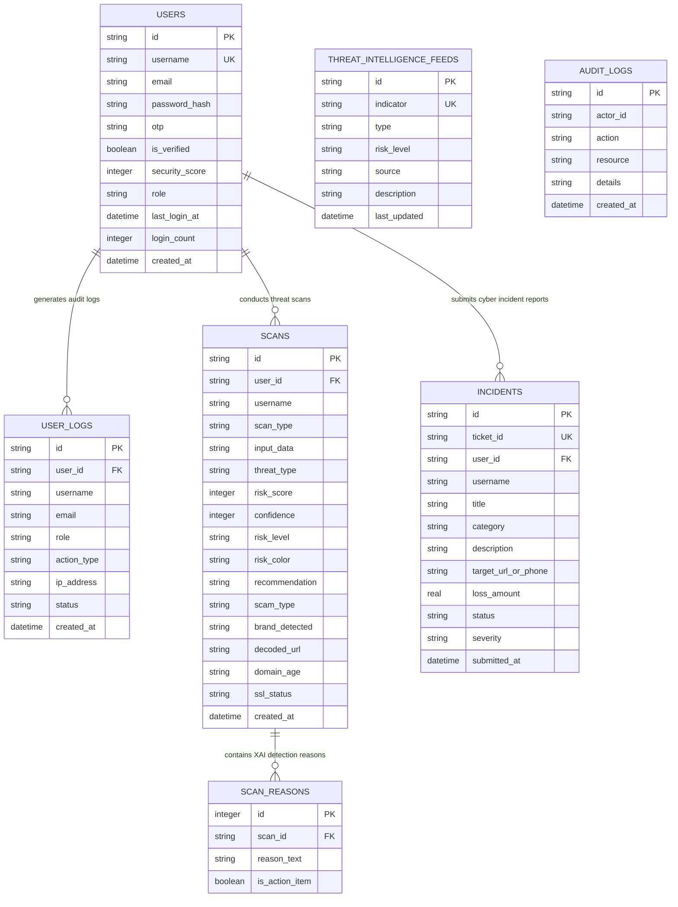

# 🏛️ CyberShield AI - Relational SQL Database Architecture & Documentation

CyberShield AI uses an enterprise-grade **Relational SQL Database Engine (SQLite3 / PostgreSQL / MySQL)** designed according to Third Normal Form (3NF) relational modeling standards, foreign key integrity rules, composite performance indexes, and analytical SQL reporting views.

---

## 📐 Entity-Relationship (ER) Architecture Diagram



---

## 📊 SQL Analytical Views

The system includes pre-compiled relational SQL views for high-throughput reporting:

### 1. `v_threat_analytics`
Aggregates scan counts, high risk detections, clean scans, average threat score, and AI confidence across all 8 attack vectors (`url`, `email`, `sms`, `qr`, `voice`, `screenshot`, `domain`, `aichat`):
```sql
SELECT * FROM v_threat_analytics;
```

### 2. `v_incident_sla_status`
Summarizes open incident tickets, total financial loss in currency (₹), and severity levels:
```sql
SELECT * FROM v_incident_sla_status;
```

### 3. `v_user_security_profiles`
Joins user security scores, login frequency, total scans executed, and personal threat index:
```sql
SELECT * FROM v_user_security_profiles;
```

---

## ⚡ SQL Performance Indexing Strategy

To guarantee sub-millisecond query performance under enterprise workloads:
- `idx_scans_threat_risk`: Composite index on `scans(risk_score, threat_type)` for real-time threat filtering.
- `idx_scans_user_date`: Index on `scans(user_id, created_at)` for user scan history pagination.
- `idx_incidents_ticket`: Unique index on `incidents(ticket_id)` for instant ticket lookup.
- `idx_user_logs_user`: Foreign key index on `user_logs(user_id)` for quick audit trail queries.

---

## 🚀 CLI Commands & Management

| Task | Shell Command | Description |
|---|---|---|
| **Initialize & Seed SQL Database** | `node database/init_sql.js` | Runs schema DDL, loads seed datasets, and outputs diagnostic tables. |
| **Inspect DB Health** | `node -e "require('./database/sqlDb').getStats().then(console.log)"` | Prints active connection status, storage size (KB), and table counts. |

---

## 🔄 PostgreSQL & MySQL Production Migration Guide

For enterprise production deployments targeting PostgreSQL or MySQL:
1. Replace `cybershield.sqlite` connection string in `database/sqlDb.js` with `pg` (node-postgres) or `mysql2`.
2. Run `database/schema.sql` directly in PostgreSQL (`psql -f database/schema.sql`) or MySQL (`mysql < database/schema.sql`).
